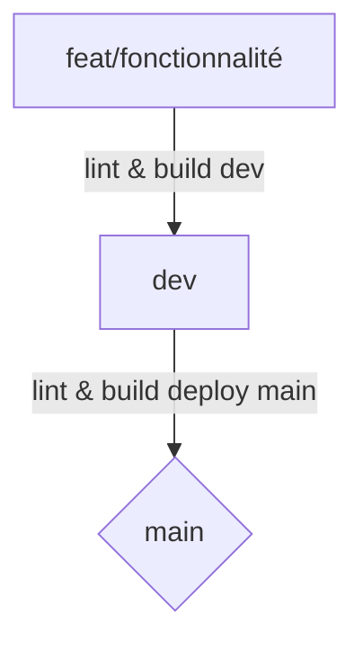

# EC06 Blanc

## Section 1 — Workflow Git et Docker

### Stratégies de prefixes & gitflow

Pour notre gitflow nous allons utiliser les préfixes suivant

| prefix | Description                                            |
|-------|--------------------------------------------------------|
| feat  | Nouvelle fonctionnalitée                               |
| fix   | Réglage d'un bug utilisateur                           |
| docs  | changement dans la documentation                       |
| ref   | Refactorisation du code / amelioration de performances |
| style | modification d'elements stylistiques                   |
| typo  | Modification de textes                                 |
| test  | Ajout / modification de test applicatifs               |
| chore | tache de maintenances                                  |

#### formattage des commits

- Tout les commits doivent reutiliser les prefixes autorisés
- le message doit etre rédiger en anglais sans accents

`(prefix): <description>`

### Stratégie de branches

| Branche                | Description                                                    |
|------------------------|----------------------------------------------------------------|
| main                   | Branche principale, push directes interdits                    |
| feat/<fonctionnalitée> | branche contenant une fonctionnalitée en developpement         |
| stage                  | Branche de staging avant de passer sur la main                 |
| dev                    | branche developpement, ou les fonctionnalités sont implémentés |

Les prefixes de commit peuvent êtres utiliser a la place de feat lorsque la modification correspond uniquement un aspect
ex `typo/homepage` pour une branches contenant de multiples modification de la page d'acceuil

## Section 2 — Architecture du pipeline CI/CD



Les commits sont fait sur des branches correctementes nommées, (voir conventions de nommage)
Une fois les branches complétés elles passent en pull request sur la branch dev,
la branch dev fait des check lint et build, de release,

Une fois que les changements de la branches dev accumulés sont complets, ont crééer une pull request de release, sur la main qui va lancer une actions de lint (verification), et de build (release)

## Section 3 — Gestion des secrets

Les secrets sont gérés par environements, dans l'onglet environements des settings de github il y a deux environements un main et un dev, comme ca les workflow utilisent leurs bon environements pour l'utilisations des secrets.

Aucun secret n'est commit dans les `.env` ni le `compose.yml`
Les fichiers d'environements sauf .env.dist sont totalement exclus des tracking grace au `.gitignore`

```bash
adryan@desktop /m/c/U/b/D/c/b/EC06 (dev)> git ls-files .env
adryan@desktop /m/c/U/b/D/c/b/EC06 (dev)>
```
On peut voir que la commande retourne vite ce qui confirme que le fichier .env a bien été enlever du tracking

## Section 4 — Instructions et limites

Pour l'installation il faudra node > 20 & docker

```bash
git clone https://github.com/aydryun/skillhub-api.git
cd skillhub-api

cp .env.dist .env
#renseigner des valeurs dans le .env
docker compose up
# le server devrait se lancer sur localhost:3000
```

pour l'amelioration on pourait faire une deploiement automatique sur dockerhub apres la confirmation du build dans la branch main, Pour cela il faudrait reseigner les creditentials de publications dockerhub dans les secrets d'environement main github, et les utiliser dans une workflow nommé `publish.yml`
## Sources

Tableaux markdown: <https://www.tablesgenerator.com/markdown_tables>
gitignore : <https://github.com/github/gitignore/blob/main/Node.gitignore>
